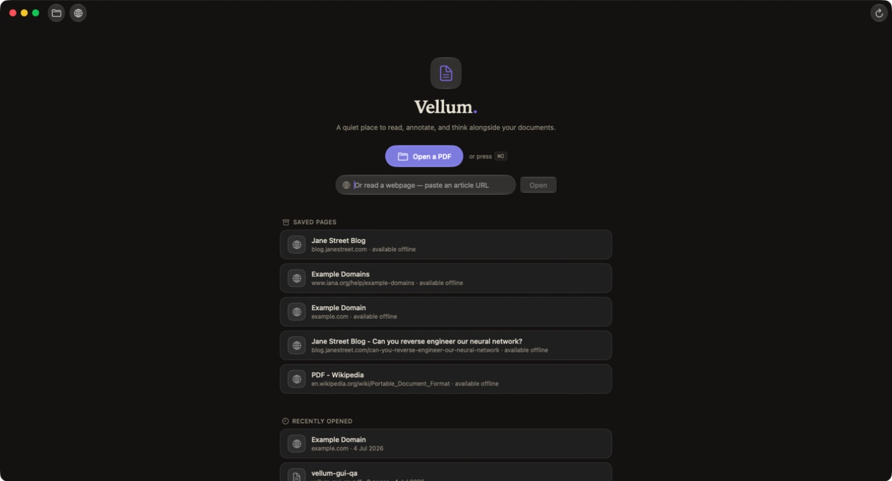
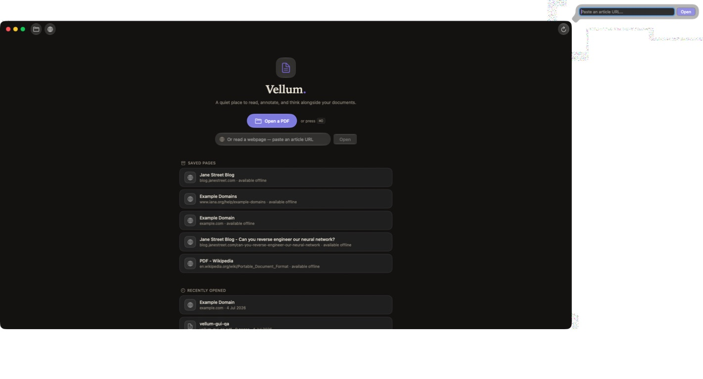
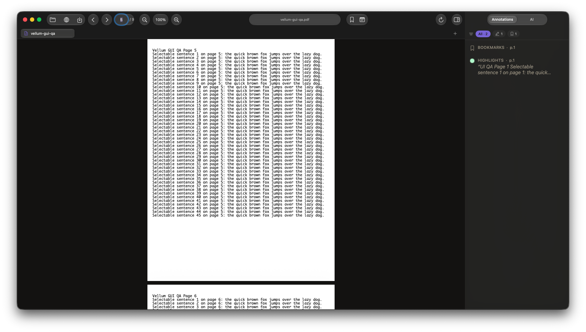
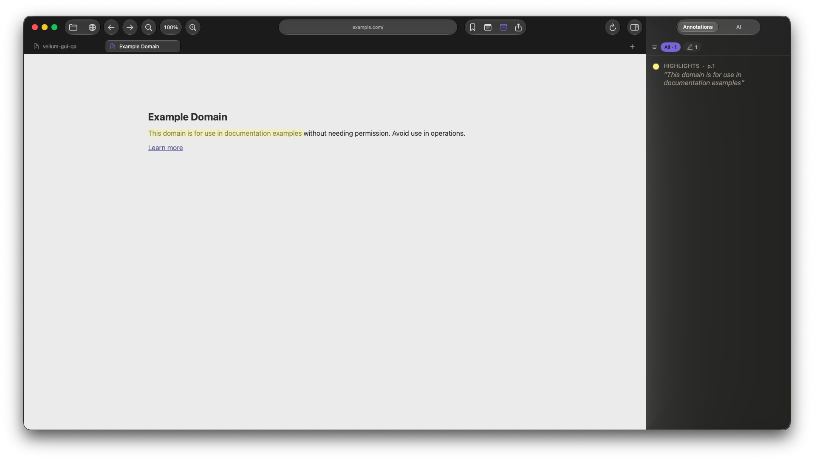
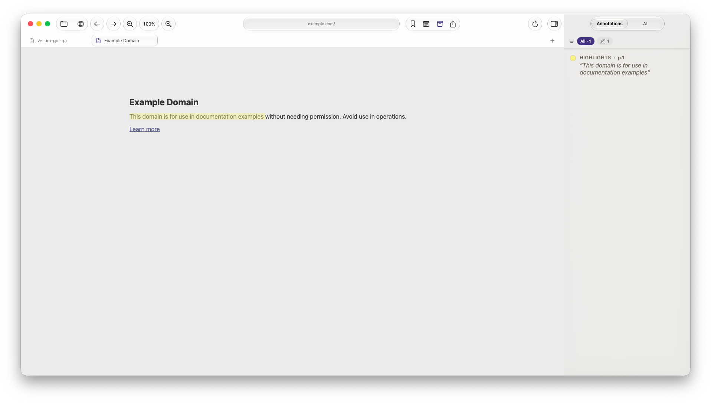
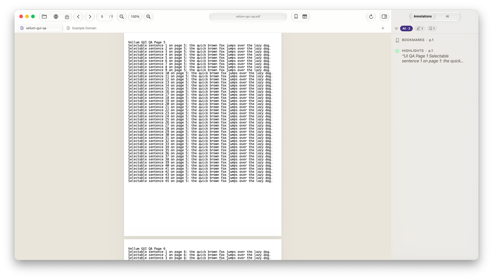
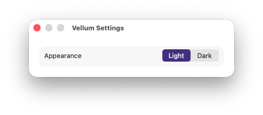

# Vellum macOS UI/UX audit

Audited 4 July 2026 against commit `cd95f53` and the live debug build at `.dd/central/Build/Products/Debug/Vellum.app`. The checkout already contained uncommitted SwiftUI work, so line references describe the current working tree, while screenshots describe the running binary.

## Executive summary

The application is functional and already uses native SwiftUI window, toolbar, inspector, control-group, PDFKit, and Liquid Glass APIs. The largest problems are not a lack of glass; they are broken anchoring, missing native command/menu structure, weak accessibility semantics, and too many equally prominent glass pods.

Recommended order:

1. Fix the detached Add Webpage popover and verify it on every display/window position.
2. Replace the ad-hoc key monitor as the primary command surface with real macOS menus and commands.
3. Repair the sidebar segmented control's accessibility labels.
4. Establish a coherent toolbar hierarchy and stable layout shared by PDF and webpage tabs.
5. Add the missing reader commands: Find, Print, tab cycling, zoom reset, and a real New Tab flow.
6. Add a System appearance option, then tune contrast and selection states in both themes.

## Evidence gallery

### Welcome screen



The centered hero is clear, but the independent rounded cards and all-caps section labels feel more like a web dashboard than a native macOS library. The toolbar repeats the same Open/Add entry points already present in the body.

### Add Webpage popover is detached from its window



The Vellum window ends around the right edge of the black surface. The URL popover appears at the far upper-right of the display, outside the application window. This is a blocking usability bug, not a cosmetic alignment issue.

### PDF workspace



The document canvas and inspector are understandable, but the titlebar contains many same-weight circular controls, two custom capsules, and an additional custom tab row. The visual hierarchy does not tell the user which controls are primary reading controls and which are occasional actions.

### Web workspace



Web highlighting worked in this test. The screenshot also shows the large contrast jump between dark chrome and light page content, the very wide empty canvas on short articles, and the inspector's low-density use of space.

### Light theme





Light mode exposes the current material inconsistency most clearly: native toolbar circles, the hand-drawn address capsule, glass segmented control, custom glass tab, plain inspector background, and warm document well all use slightly different edge/contrast treatments.

### Settings



The 400 x 112 point settings window is technically valid but feels unfinished. It has no System appearance choice and no room for future reading, annotation, AI, or shortcut settings.

## Prioritized findings

### P0 — Fix the Add Webpage popover's screen anchoring

- **Observed:** Pressing `⌘L` opened the URL popover outside the Vellum window, at the far edge of another screen region. The problem reproduced from both the welcome screen and an open document.
- **Evidence:** `Vellum/Views/PDF/ToolbarView.swift:111-145` attaches a fixed-width `TextField` popover directly to a toolbar item. The screenshot above demonstrates the runtime result.
- **Impact:** The primary webpage entry flow can be effectively unusable. On a multi-display setup it can also look like nothing happened.
- **Effort / risk:** S-M / medium. Popover positioning around `NSToolbar` and multiple displays is easy to regress.
- **Recommendation:** Prefer a small sheet or command dialog centered over the Vellum window. If a popover is retained, anchor an `NSPopover` to the actual toolbar item's view and constrain/reposition it to the owning screen's visible frame.
- **Acceptance test:** Test `⌘L` with the window centered, touching each screen edge, on every connected display, in full screen, and at the 800 x 600 minimum size. The complete field and Open button must remain inside the owning screen and visually point to the toolbar control.

### P0 — Add a real native command and menu model

- **Observed:** The live menu bar exposes `Vellum`, `Edit`, `View`, `Window`, and `Help`; there is no File menu. Open, Save, Close Tab, Add Webpage, bookmarks, tabs, and zoom shortcuts are therefore not discoverable from menus.
- **Evidence:** `Vellum/App/VellumApp.swift:50-77` defines the window and Settings scene but no `.commands`. `Vellum/App/ContentView.swift:137-230` implements most commands in a local `NSEvent` monitor.
- **Impact:** The app does not behave like a native document app, keyboard shortcuts cannot be found or remapped through the normal command surface, menu validation is absent, and key routing can conflict with PDFKit/WebKit or text fields.
- **Effort / risk:** M / medium.
- **Recommendation:** Define `CommandGroup`/`CommandMenu` entries and route them to focused scene actions. At minimum add File, Navigate, View, and Annotation commands. Keep a local event monitor only for interactions that SwiftUI commands cannot express.
- **Acceptance test:** Every advertised shortcut appears in a menu, is disabled when unavailable, works with PDF and webpage tabs, and does not fire while a text field or Settings window owns focus.

### P0 — Repair the Annotations/AI accessibility names

- **Observed:** Computer Use exposed both sidebar segments as buttons named `Annotations`; the AI segment was not announced as AI.
- **Evidence:** `Vellum/Views/Shared/Controls.swift:123-139` puts hidden copies of every option label inside every button to equalize width. Those hidden sizing labels still influence the accessibility name. `Vellum/App/ContentView.swift:45-52` supplies the two labels.
- **Impact:** VoiceOver and other accessibility clients cannot distinguish the two destinations. UI automation also cannot address the AI segment reliably.
- **Effort / risk:** S / low.
- **Recommendation:** Mark sizing-only text as accessibility-hidden, set an explicit `.accessibilityLabel(option.label)` on each button, expose selected state, and consider using a native segmented Picker unless the custom morph adds measurable value.
- **Acceptance test:** Accessibility Inspector and Computer Use must report exactly `Annotations, selected` and `AI` (or the inverse), not duplicate names.

### P1 — Investigate the `⌘D` shortcut collision

- **Observed:** In two automated runs, `⌘D` did not toggle the inspector; instead the current bookmark state changed. Clicking the inspector toolbar button worked. This may be an event-routing conflict or an automation key-mapping edge case, so confirm with a physical keyboard before changing behavior.
- **Evidence:** `Vellum/App/ContentView.swift:207-218` handles `⌘B` and `⌘D` in the same local monitor. There is no menu command that makes routing/validation visible.
- **Impact:** A shortcut advertised in code may perform a destructive or surprising adjacent action.
- **Effort / risk:** S to investigate; S-M to fix.
- **Recommendation:** Add command logging in Debug, test the produced characters/key codes under the user's keyboard layout, and move both actions into SwiftUI commands. Consider the conventional `⌘⌥S` or a View-menu command for the inspector if `⌘D` conflicts with embedded content.

### P1 — Add essential reader commands

- **Observed:** `⌘O`, `⌘L`, `⌘S`, `⌘W`, `⌘1…9`, zoom, bookmark, inspector, Escape, and `N` are wired. There is no document search, print, zoom reset shortcut, next/previous tab shortcut, or New Tab command.
- **Evidence:** The complete shortcut handler is `Vellum/App/ContentView.swift:153-230`; no additional command declarations exist in `Vellum/App/VellumApp.swift`.
- **Impact:** Search and print are baseline expectations for a PDF/web reader. Number shortcuts do not scale beyond nine tabs and are poor substitutes for tab cycling.
- **Effort / risk:** M-L depending on PDF/web search implementation.
- **Recommendation:** Add:
  - `⌘F` Find with PDFKit and webpage implementations.
  - `⌘P` Print using the active PDF/WebKit print operation.
  - `⌘0` Actual Size / reset zoom.
  - `⌘⇧[` and `⌘⇧]` previous/next tab.
  - `⌘T` New Tab/start page.
  - Menu commands for next/previous page and first/last page.

### P1 — Make New Tab a real cross-format flow

- **Observed:** The tab bar's plus button is labelled and implemented only as `Open PDF in new tab`, even though Vellum supports web pages equally.
- **Evidence:** `Vellum/Views/PDF/TabBarView.swift:28-55` always presents a PDF-only `NSOpenPanel`.
- **Impact:** Webpage creation is hidden in a toolbar globe and `⌘L`, while the universal tab affordance supports only one content type.
- **Effort / risk:** M / low.
- **Recommendation:** `+` and `⌘T` should create a start tab containing Recent, Open PDF, and Open Webpage. A short press could open the start tab; an optional menu can expose Open PDF/Open Webpage directly.

### P1 — Reduce toolbar "pill soup" and establish stable slots

- **Observed:** File actions, web history/page navigation, zoom, title/address, bookmark/note/library/export, updater, and inspector all compete in one titlebar. Most actions have the same circular glass weight. PDF and webpage tabs insert/remove clusters, causing controls to move between modes.
- **Evidence:** `Vellum/Views/PDF/ToolbarView.swift:13-84` declares the complete adaptive toolbar. `DocumentTitleField` adds another hand-drawn capsule at `ToolbarView.swift:497-524`.
- **Impact:** The toolbar looks busy despite ample space, scanning is slow, and switching tab types moves familiar controls.
- **Effort / risk:** M / medium.
- **Recommendation:** Keep stable regions:
  - Leading: back/forward for web or previous/next page for PDF.
  - Center: document title/address, visually quiet and not pretending to be editable.
  - Trailing: bookmark/note, inspector toggle, overflow menu.
  - Move Open, Save, Export, updater, and low-frequency library actions into menus/overflow. Retain toolbar items only where repeated use justifies permanent space.
- **Acceptance test:** Switching PDF ↔ web should not move the title, bookmark, note, or inspector controls. The 800 point minimum window must not clip or silently drop essential controls.

### P1 — Use one material strategy instead of mixing native and hand-drawn glass

- **Observed:** Native `ControlGroup` glass, `.glassEffect`, `.bar`, `.quaternary` capsules, opaque theme colors, and the inspector's system surface are mixed within one chrome region.
- **Evidence:** `Vellum/Views/PDF/ToolbarView.swift:14-67`, `Vellum/Views/PDF/ToolbarView.swift:510-520`, `Vellum/Views/PDF/TabBarView.swift:9-44`, and `Vellum/Views/Shared/Controls.swift:108-155` each create a different chrome treatment.
- **Impact:** The implementation uses Liquid Glass APIs but does not read as a single native material system. The effect is strongest in light mode, where every edge treatment is visible.
- **Effort / risk:** M / medium.
- **Recommendation:** Let the unified toolbar own the primary material. Avoid applying glass to every selected child. Use glass for interactive floating controls and selected/high-priority elements; use semantic fills/dividers for tabs and inspector content. Do not stack `.quaternary` backgrounds under glass unless contrast testing proves it necessary.

### P1 — Strengthen active-tab and selected-state hierarchy

- **Observed:** In light mode, the active tab is only slightly more prominent than the inactive tab. The selected inspector segment is clearer, but selected tabs, current toolbar tools, and filter chips use different visual languages.
- **Evidence:** `Vellum/Views/PDF/TabBarView.swift:83-126` changes text/icon tint and applies regular glass only to the active tab. Filter and tool states use separate styles elsewhere.
- **Impact:** Users must read labels to determine context, especially with several similarly named documents.
- **Effort / risk:** S-M / low.
- **Recommendation:** Define shared tokens for selected tab, selected segmented item, active annotation tool, and selected filter. Active tabs need a stronger surface/edge or connection to the content area; inactive tabs should remain quieter without becoming disabled-looking.

### P1 — Add a live System appearance mode

- **Observed:** Settings offers only Light and Dark. Vellum follows macOS only on first launch; after either option is stored, later OS appearance changes are ignored.
- **Evidence:** `Vellum/Views/Shared/Theme.swift:29-32` defines only two themes. `ThemeStore` reads system appearance only when no preference exists at `Theme.swift:129-145`. `Vellum/Views/Settings/SettingsView.swift:8-18` exposes only the two segments.
- **Impact:** The app does not meet the normal macOS expectation of following system appearance, and it cannot switch automatically at sunset or when the user changes Control Center appearance.
- **Effort / risk:** S-M / low.
- **Recommendation:** Add `AppTheme.system`, avoid forcing `preferredColorScheme` in that mode, and react to effective appearance changes. Present System / Light / Dark in Settings.

### P2 — Give Settings a durable information architecture

- **Observed:** The Settings window is a 400 x 112 point single-row form.
- **Evidence:** `Vellum/Views/Settings/SettingsView.swift:8-18` fixes width and vertical size to content.
- **Impact:** It looks temporary and leaves no obvious home for AI providers/models, default annotation color, reading defaults, update preferences, or keyboard shortcut help.
- **Effort / risk:** M / low.
- **Recommendation:** Use a normal macOS Settings scene with sections or tabs: General, Reading, Annotations, AI. Do not add empty pages now; establish the structure as settings move out of ad-hoc popovers.

### P2 — Make the welcome library feel native and scale beyond a handful of items

- **Observed:** Saved and recent items are separate rounded cards with all-caps headers in a narrow centered column. This is attractive at five items but uses little of a desktop window and becomes scroll-heavy as the library grows.
- **Evidence:** `Vellum/Views/Welcome/WelcomeScreen.swift` limits the core column to 672 points and list rows to 448 points (`:47`, `:131`), with custom card styling around `:393-446`.
- **Impact:** The start screen feels web-derived and will not scale to a serious document library.
- **Effort / risk:** M / low.
- **Recommendation:** Keep the calm hero for an empty/first-run state. Once content exists, use an inset grouped list or sidebar/content library with sortable Recent and Saved sections, standard row selection, context menus, keyboard navigation, and Delete/Remove commands.

### P2 — Make the inspector denser and more contextual

- **Observed:** Short annotation lists and the AI empty state leave most of a 340 point inspector unused. Filters use compact chips, while content rows use small italic snippets with limited metadata.
- **Evidence:** Inspector sizing is `min: 240, ideal: 340, max: 700` at `Vellum/App/ContentView.swift:33-56`. AI empty-state and composer layout are in `Vellum/Views/AI/AiPanel.swift:33-96` and `:153-190`.
- **Impact:** The panel reads as a large blank column rather than a productive secondary workspace.
- **Effort / risk:** M / low.
- **Recommendation:** Add a clear panel header, counts/search where useful, page/location metadata, and stronger row affordances. Keep the AI composer pinned, but let empty-state copy occupy a compact card near the top instead of floating in a large void.

### P2 — Verify minimum-window behavior explicitly

- **Observed:** The app declares an 800 x 600 minimum but combines a 240 point minimum inspector, a 300/420 point title field, several toolbar clusters, and 128–224 point tabs.
- **Evidence:** `Vellum/App/VellumApp.swift:53-67`, `Vellum/App/ContentView.swift:33-35`, `Vellum/Views/PDF/ToolbarView.swift:517-520`, and `Vellum/Views/PDF/TabBarView.swift:114-126`.
- **Impact:** The fixed sizes leave little room for graceful compression, localization, larger text, or the inspector at the minimum window width.
- **Effort / risk:** S to characterize; M to fix.
- **Confidence:** Medium; Computer Use could not reliably drag the current multi-display window to 800 x 600, so this needs a dedicated manual pass.
- **Recommendation:** Add screenshot/interaction tests at 800 x 600, 1024 x 700, and 1280 x 800. Define which actions enter an overflow menu and when the inspector auto-collapses.

## Shortcut and interaction test matrix

| Interaction | Result | Notes |
|---|---|---|
| `⌘L` Add Webpage | Fail | Opens, but the popover is detached from the owning window. |
| Enter URL and Return | Pass | Opened `https://example.com` as a new web tab. |
| `⌘O` | Partial | Open panel opened; file selection was not repeated after the menu-session issue. |
| `⌘,` | Pass | Settings opened and appearance changes applied. |
| `⌘1`, `⌘2` | Pass | Switched between PDF and webpage tabs. |
| `⌘⇧=` / toolbar zoom | Pass | PDF zoom changed in 10% increments; reset control worked. |
| Direct PDF page entry | Pass | Entering page 5 and Return navigated to page 5. |
| `N`, then Escape | Pass | Entered sticky-note mode and returned to view mode. |
| Sidebar toolbar button | Pass | Inspector hid and restored correctly. |
| `⌘D` | Investigate | Automation toggled bookmark state rather than the inspector in two runs. Verify physically. |
| Web text selection | Pass | Selection popover appeared with five colors and Add Note. |
| Web highlight creation | Pass | Yellow highlight rendered and appeared in the inspector. |
| PDF annotation list | Pass | Existing bookmark/highlight appeared and filters exposed counts. |
| AI/Annotations switch | Visual pass, a11y fail | Both segments were exposed to accessibility as `Annotations`. |
| Light ↔ Dark | Pass | Applied immediately; System mode is missing. |

## Implementation sequence for another agent

1. **Command foundation:** Add menu commands and focused actions without changing existing behavior. Add tests for command availability and text-input focus.
2. **Popover fix:** Replace or correctly anchor Add Webpage. Verify on the actual multi-display arrangement using Computer Use plus window captures.
3. **Accessibility:** Fix segmented labels, audit all toolbar buttons with Accessibility Inspector, and add UI automation identifiers.
4. **Toolbar simplification:** Produce one PDF and one web toolbar spec with stable positions, then implement both together.
5. **Tabs and New Tab:** Add `⌘T`, start-tab content, tab cycling, and overflow behavior.
6. **Reader basics:** Implement Find and Print for both document types, plus zoom reset and navigation commands.
7. **Appearance:** Add System mode and consolidate material/selection tokens. Re-run light/dark screenshots.
8. **Library/inspector polish:** Improve welcome/library scaling and panel density after the shell is stable.

## Verification gates

Build and tests:

```bash
xcodebuild -project Vellum.xcodeproj -scheme Vellum -configuration Debug build
xcodebuild -project Vellum.xcodeproj -scheme Vellum test
```

Every UI change should then be exercised in the running application with Computer Use. Capture PDF and web states in Light, Dark, and System appearances at minimum/default/full-screen sizes. For command work, test with the PDF view, webpage view, AI composer, URL field, page field, and Settings window focused.

## Scope limits

This pass focused on the app shell, welcome screen, PDF/web reading workspaces, inspector, appearance settings, keyboard entry points, and accessibility tree. It did not send an AI message, invoke microphone/speech, print a real document, export an archive, delete user data, test updater installation, or exhaustively validate every annotation edit popover. One yellow highlight was created on the saved `example.com` page as part of runtime verification.
